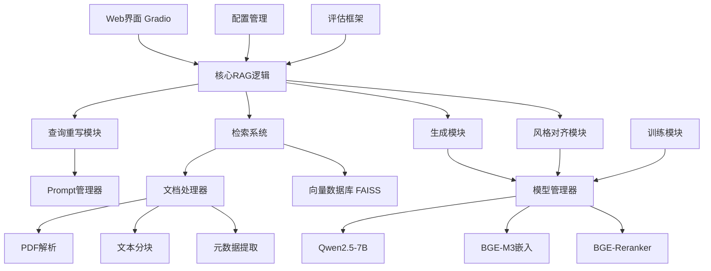
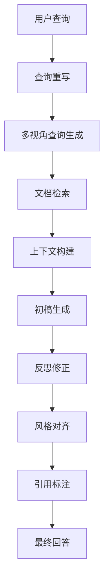

# 设计文档

## 概述

AI投资分析师"Value-Seeker"采用现代化的RAG（检索增强生成）架构，结合先进的文档处理、多阶段检索、反思修正链和风格对齐技术，为用户提供专业的投资分析服务。系统设计遵循模块化、可扩展和高性能的原则。

## 架构设计

### 整体架构



### 核心组件架构

系统采用分层架构设计：

1. **表示层**: Gradio Web界面
2. **业务逻辑层**: 核心RAG逻辑、查询处理、生成控制
3. **服务层**: 文档处理、检索服务、模型服务
4. **数据层**: 向量数据库、文档存储、配置管理

## 组件和接口

### 1. 配置管理系统 (config.yaml)

**设计目标**: 统一管理所有系统参数，支持多环境配置

**核心接口**:
```python
class ConfigManager:
    def __init__(self, config_path: str)
    def get_model_config(self) -> ModelConfig
    def get_data_config(self) -> DataConfig
    def get_retrieval_config(self) -> RetrievalConfig
    def get_prompt_config(self) -> PromptConfig
    def get_training_config(self) -> TrainingConfig
    def reload_config(self) -> None
```

**配置结构**:
```yaml
model_config:
  base_model: "Qwen/Qwen2.5-7B-Instruct"
  device: "cuda"
  max_memory: "20GB"
  quantization: "4bit"

data_config:
  reports_dir: "./data/reports/"
  corpus_dir: "./data/dyp_corpus/"
  chunk_size: 512
  chunk_overlap: 50

retrieval_config:
  embedding_model: "BAAI/bge-m3"
  reranker_model: "BAAI/bge-reranker-large"
  vector_store_path: "./deploy/vector_store/"
  top_k: 10
  rerank_top_k: 3

prompt_config:
  query_rewrite_version: "v1"
  generation_version: "v1"
  style_version: "v1"
  judge_version: "v2"
```

### 2. 文档处理模块 (DocumentProcessor)

**设计目标**: 实现高保真的父子文档分块策略，支持表格和文本的分离处理

**核心接口**:
```python
class DocumentProcessor:
    def __init__(self, config: DataConfig)
    def parse_pdf_with_parent_child(self, pdf_path: str) -> Tuple[List[ParentChunk], List[ChildChunk]]
    def extract_tables_with_pdfplumber(self, pdf_path: str) -> List[TableChunk]
    def extract_text_with_unstructured(self, pdf_path: str, table_boundaries: List[Dict]) -> List[TextElement]
    def create_parent_child_relationships(self, tables: List[TableChunk], texts: List[TextElement]) -> Tuple[List[ParentChunk], List[ChildChunk]]
    def chunk_long_text(self, text_elements: List[TextElement]) -> List[ChildChunk]
```

**数据模型**:
```python
@dataclass
class ParentChunk:
    parent_id: str
    content: str  # 完整的页面内容或逻辑章节
    metadata: Dict[str, Any]
    page_numbers: List[int]
    chunk_type: str  # "page", "section"

@dataclass
class ChildChunk:
    child_id: str
    parent_id: str  # 关联的父分块ID
    content: str
    metadata: Dict[str, Any]
    embedding: Optional[np.ndarray]
    chunk_type: str  # "table", "text"
    page_number: int
    boundary_box: Optional[Dict[str, float]]

@dataclass
class TableChunk:
    table_id: str
    markdown_content: str  # 序列化的Markdown表格
    page_number: int
    boundary_box: Dict[str, float]  # {"x0": float, "y0": float, "x1": float, "y1": float}
    table_type: str  # "financial", "summary", "other"
```

**处理流程**:
1. **高保真表格提取**: 使用pdfplumber遍历PDF页面，提取所有结构化表格，序列化为Markdown字符串
2. **高保真文本提取**: 使用unstructured解析PDF，传入表格边界框列表，跳过表格区域避免重复处理
3. **文本二次分块**: 对较长文本段落使用语义分块或递归字符分块进行切分
4. **构建父子关系**: 定义父分块（页面或章节），创建子分块（表格Markdown和文本小块）
5. **关联与存储**: 为子分块添加元数据，向量化存入向量数据库，父分块存入文档存储

### 3. 父子文档检索系统 (ParentChildRetrievalSystem)

**设计目标**: 实现父子文档检索策略，通过子分块检索获取完整父分块上下文

**核心接口**:
```python
class ParentChildRetrievalSystem:
    def __init__(self, config: RetrievalConfig)
    def build_child_index(self, child_chunks: List[ChildChunk]) -> None
    def store_parent_documents(self, parent_chunks: List[ParentChunk]) -> None
    def retrieve_parent_via_children(self, queries: List[str], top_k: int = 10) -> List[ParentChunk]
    def search_child_chunks(self, query: str) -> List[ChildChunk]
    def get_parent_chunks(self, parent_ids: List[str]) -> List[ParentChunk]
    def rerank_child_results(self, query: str, candidates: List[ChildChunk]) -> List[ChildChunk]
```

**检索流程**:


**存储架构**:
1. **向量数据库**: 存储所有子分块的向量表示，用于相似度检索
2. **文档存储**: 键值存储，存储完整的父分块内容，以父分块ID为键
3. **元数据索引**: 维护子分块到父分块的映射关系

**检索策略**:
1. **子分块检索**: 在向量数据库中检索最相关的子分块
2. **父分块提取**: 从子分块元数据中提取对应的父分块ID
3. **完整上下文获取**: 从文档存储中取出完整的父分块内容
4. **上下文优化**: 去重和排序父分块，确保上下文质量

### 4. Prompt管理系统 (PromptManager)

**设计目标**: 版本化管理Prompt模板，支持动态加载和A/B测试

**核心接口**:
```python
class PromptManager:
    def __init__(self, config: PromptConfig)
    def get_query_rewrite_prompt(self, query: str) -> str
    def get_drafting_prompt(self, query: str, context: str) -> str
    def get_refinement_prompt(self, query: str, draft: str, context: str) -> str
    def get_style_prompt(self, content: str) -> str
    def get_judge_prompt(self, query: str, answer: str) -> str
    def load_prompt_template(self, template_path: str) -> str
```

**Prompt模板结构**:
```
prompts/
├── query_rewriting/
│   └── v1_multi_perspective.txt
├── generation/
│   ├── v1_drafting.txt
│   └── v1_refinement.txt
├── style_alignment/
│   └── v1_dyp_style.txt
└── llm_as_judge/
    └── v2_multi_dimension.txt
```

### 5. 核心RAG逻辑 (ValueSeekerRAG)

**设计目标**: 实现完整的RAG管道，集成多视角查询、反思修正链

**核心接口**:
```python
class ValueSeekerRAG:
    def __init__(self, config: Dict[str, Any])
    def generate(self, query: str) -> Dict[str, Any]
    def _rewrite_query(self, query: str) -> List[str]
    def _retrieve_documents(self, queries: List[str]) -> List[Chunk]
    def _generate_draft(self, query: str, context: str) -> str
    def _refine_answer(self, query: str, draft: str, context: str) -> str
    def _format_response(self, answer: str, sources: List[Chunk]) -> Dict[str, Any]
```

**处理流程**:


### 6. 模型管理系统 (ModelManager)

**设计目标**: 统一管理多个模型的加载、量化和推理

**核心接口**:
```python
class ModelManager:
    def __init__(self, config: ModelConfig)
    def load_base_model(self, model_name: str) -> Any
    def load_embedding_model(self, model_name: str) -> Any
    def load_reranker_model(self, model_name: str) -> Any
    def setup_quantization(self, bits: int) -> None
    def get_model_info(self) -> Dict[str, Any]
    def optimize_memory(self) -> None
```

**模型配置**:
- **基础模型**: Qwen2.5-7B-Instruct (4bit量化)
- **嵌入模型**: BAAI/bge-m3
- **重排模型**: BAAI/bge-reranker-large
- **内存优化**: 梯度检查点、模型并行

## 数据模型

### 核心数据结构

```python
@dataclass
class InvestmentQuery:
    query_id: str
    original_query: str
    rewritten_queries: List[str]
    timestamp: datetime
    user_id: Optional[str]

@dataclass
class AnalysisResult:
    query_id: str
    answer: str
    confidence_score: float
    sources: List[ParentChunkCitation]
    processing_time: float
    style_score: float

@dataclass
class ParentChunkCitation:
    parent_id: str
    child_ids: List[str]  # 触发检索的子分块ID列表
    content: str  # 完整的父分块内容
    page_numbers: List[int]
    relevance_score: float
    citation_text: str
```

### 数据库设计

**向量数据库 (FAISS)**:
- 索引类型: IndexHNSWFlat
- 维度: 1024 (BGE-M3)
- 距离度量: 余弦相似度
- 存储内容: 所有子分块的向量表示

**文档存储 (键值存储)**:
- 键: 父分块唯一ID
- 值: 完整的父分块内容
- 用途: 通过父分块ID快速获取完整上下文

**元数据索引**:
- 子分块到父分块的映射关系
- 页码和边界框信息
- 分块类型标识（表格/文本）

## 错误处理

### 异常处理策略

```python
class ValueSeekerException(Exception):
    """基础异常类"""
    pass

class DocumentProcessingError(ValueSeekerException):
    """文档处理异常"""
    pass

class RetrievalError(ValueSeekerException):
    """检索异常"""
    pass

class GenerationError(ValueSeekerException):
    """生成异常"""
    pass

class ModelLoadError(ValueSeekerException):
    """模型加载异常"""
    pass
```

### 错误恢复机制

1. **文档处理失败**: 跳过问题文档，记录错误日志
2. **检索失败**: 降级到关键词检索
3. **生成失败**: 返回基础回答模板
4. **模型加载失败**: 使用备用模型或CPU模式
5. **网络异常**: 实现重试机制和超时控制

### 日志系统

```python
import logging
from datetime import datetime

class ValueSeekerLogger:
    def __init__(self, log_level: str = "INFO"):
        self.logger = logging.getLogger("value_seeker")
        self.setup_logging(log_level)
    
    def log_query(self, query: str, user_id: str):
        """记录用户查询"""
        
    def log_retrieval(self, query: str, results_count: int, processing_time: float):
        """记录检索性能"""
        
    def log_generation(self, query: str, answer_length: int, processing_time: float):
        """记录生成性能"""
        
    def log_error(self, error: Exception, context: Dict[str, Any]):
        """记录错误信息"""
```

## 测试策略

### 单元测试

**测试覆盖范围**:
- 文档处理模块: PDF解析、分块、元数据提取
- 检索系统: 向量检索、重排序、结果融合
- 生成模块: Prompt构建、模型推理、后处理
- 配置管理: 配置加载、验证、环境切换

**测试框架**: pytest + pytest-cov

### 集成测试

**测试场景**:
- 端到端查询处理流程
- 多用户并发访问
- 大文档处理性能
- 模型切换和恢复

### 性能测试

**关键指标**:
- 查询响应时间 < 10秒
- 并发用户支持 ≥ 5人
- 内存使用 < 20GB
- 检索精度 > 90%

**测试工具**: locust + memory_profiler

## 部署架构

### Docker容器化

**服务组件**:
```yaml
version: '3.8'
services:
  web-app:
    build: .
    ports:
      - "7860:7860"
    volumes:
      - ./data:/app/data
      - ./deploy:/app/deploy
    environment:
      - CUDA_VISIBLE_DEVICES=0
      
  vector-db:
    image: faiss-cpu
    volumes:
      - ./deploy/vector_store:/data
      
  model-server:
    image: vllm/vllm-openai
    ports:
      - "8000:8000"
    environment:
      - MODEL_NAME=Qwen/Qwen2.5-7B-Instruct
```

### 云端部署

**基础设施要求**:
- GPU: NVIDIA A100/V100 (24GB+ VRAM)
- CPU: 16+ cores
- RAM: 64GB+
- 存储: 500GB+ SSD

**部署流程**:
1. 环境检查和依赖安装
2. 模型下载和量化
3. 知识库构建和索引
4. 服务启动和健康检查
5. 负载均衡和监控配置

### 监控和运维

**监控指标**:
- 系统资源使用率
- 查询响应时间分布
- 错误率和异常统计
- 模型推理性能
- 用户访问模式

**运维工具**:
- Prometheus + Grafana (指标监控)
- ELK Stack (日志分析)
- Docker Compose (服务编排)
- Weights & Biases (实验跟踪)

## 安全考虑

### 数据安全

1. **文档加密**: 敏感PDF文档加密存储
2. **访问控制**: 基于角色的权限管理
3. **数据脱敏**: 个人信息自动识别和脱敏
4. **审计日志**: 完整的操作记录和追踪

### 模型安全

1. **输入验证**: 查询内容过滤和验证
2. **输出检查**: 生成内容安全性检查
3. **模型保护**: 防止模型逆向和提取
4. **隐私保护**: 用户查询不用于模型训练

## 性能优化

### 推理优化

1. **模型量化**: 4bit/8bit量化减少内存占用
2. **批处理**: 多查询批量处理提高吞吐量
3. **缓存机制**: 常见查询结果缓存
4. **异步处理**: 非阻塞式查询处理

### 检索优化

1. **索引优化**: HNSW参数调优
2. **预计算**: 常用查询向量预计算
3. **分层检索**: 粗排+精排两阶段检索
4. **并行检索**: 多查询并行处理

### 系统优化

1. **内存管理**: 动态内存分配和释放
2. **GPU利用**: 混合精度训练和推理
3. **网络优化**: 模型并行和数据并行
4. **存储优化**: 向量压缩和快速I/O